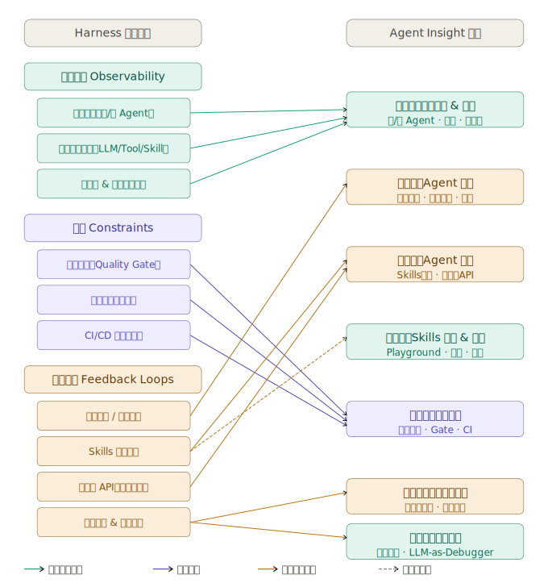
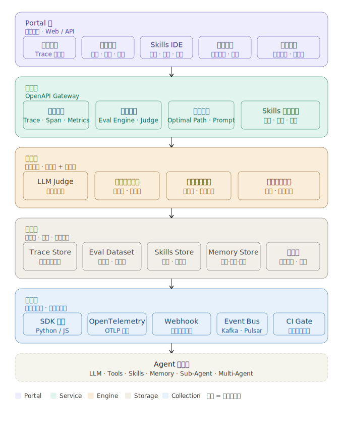
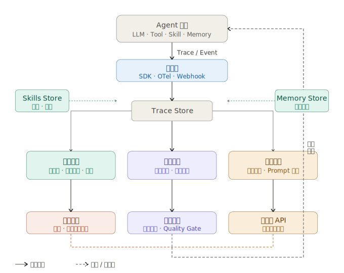

# Agent Insight 平台功能与架构设计文档

**版本**: v1.0  
**日期**: 2026-04

---

## 目录

- [一、背景与定位](#一背景与定位)
  - [1.1 业界 Agent Harness 工程定义](#11-业界-agent-harness-工程定义)
  - [1.2 Agent Insight 平台定位](#12-agent-insight-平台定位)
  - [1.3 Agent Insight 框架设计概览](#13-agent-insight-框架设计概览)
- [二、功能模块设计](#二功能模块设计)
  - [模块一：Agent 链路观测与基础数据采集](#模块一agent-链路观测与基础数据采集)
  - [模块二：Agent 评测能力](#模块二agent-评测能力)
  - [模块三：Agent 优化能力](#模块三agent-优化能力)
  - [模块四：Skills 生成与调测](#模块四skills-生成与调测)
  - [模块五：Agent 质量管控](#模块五agent-质量管控)
  - [模块六：记忆能力评估](#模块六记忆能力评估)
  - [模块七：Agent 故障定位](#模块七agent-故障定位)
- [三、架构设计](#三架构设计)
  - [3.1 整体架构分层](#31-整体架构分层)
  - [3.2 数据采集架构](#32-数据采集架构)
  - [3.3 评测引擎架构](#33-评测引擎架构)
  - [3.4 自优化 API 数据流](#34-自优化-api-数据流)
- [四、核心数据模型](#四核心数据模型)
- [五、与业界 Agent Harness 诉求的对照](#五与业界-agent-harness-诉求的对照)
- [六、路线图建议（优先级排序）](#六路线图建议优先级排序)
- [七、为什么不能基于 Langfuse 二次开发](#七为什么不能基于-langfuse-二次开发)

---

## 一、背景与定位

### 1.1 业界 Agent Harness 工程定义

根据 2026 年业界最新研究与实践（Mitchell Hashimoto、OpenAI、LangChain、Preprints.org 学术综述），**Agent Harness** 的权威定义如下：

> **Agent Harness** 是围绕 LLM 核心推理循环的非模型运行时软件基础设施，持续协调工具分发、上下文管理、安全约束与会话持久化。它是模型推理引擎的"操作系统"，将原始模型能力转化为可依赖、可重复的行动。

业界公认的 Harness 三大核心支柱（OpenAI, 2026）：
1. **约束（Constraints）**：规范模型输出空间，引入阶段门控（phase gates）、结构化交付物与上下文重置
2. **可观测性（Observability）**：监控推理轨迹与工具调用过程，支持全链路追踪
3. **反馈循环（Feedback Loops）**：支持持续能力优化，形成执行闭环

Harness 的三大外部化维度（SJTU, 2026）：
- **记忆（Memory）**：工作上下文、语义知识、情节经验、个性化记忆
- **技能（Skills）**：操作规程、决策启发式、规范约束
- **协议（Protocols）**：Agent-用户、Agent-Agent、Agent-工具的交互结构

Agent Harness 工程还强调两类组件的交叉矩阵（Martin Fowler, 2026）：
- **引导组件（Guides）** vs **感知组件（Sensors）**
- **计算型（Computational，确定性）** vs **推理型（Inferential，LLM-as-Judge）**

---

### 1.2 Agent Insight 平台定位

**Agent Insight** 是面向 Agent Harness 工程全生命周期的可观测性、评测与优化平台，覆盖"采集 → 评测 → 优化 → 质量管控"完整闭环。


*图 1：Agent Insight 平台对业界 Harness 工程三大核心支柱的映射关系，构建完整的闭环能力体系。*

旨在：
- 将 Agent 系统从"黑盒"转变为"可观测、可评测、可优化"的透明系统
- 为 Agent 研发团队提供统一的 Insight 工程底座
- 满足业界 Agent Harness 三大支柱（约束、可观测性、反馈循环）的工程诉求

---

### 1.3 Agent Insight 框架设计概览

Agent Insight 平台不仅提供单点的观测与评测能力，更致力于打造一个自底向上的完整数据流转闭环与分层架构。

**1. 整体架构分层**


*图 2：Agent Insight 平台架构概览*

架构自下而上分为四个核心层：
- **数据采集层**：通过 SDK 埋点、OpenTelemetry 等方式，无缝接入 Agent 运行时的 Trace 数据、上下文状态与关键指标。
- **数据存储层**：提供针对复杂 Agent 场景优化的集中存储，统一管理 Trace、评测数据集、长短期记忆及 Skills 元数据。
- **核心引擎层**：包含观测服务、评测服务（如大模型裁判 LLM-as-Judge）及优化服务，是驱动平台智能化的核心"大脑"。
- **用户界面层**：为研发团队提供直观的链路看板、评测中心、Skills IDE 与质量管控门户，实现可视化管理。

**2. 数据流转闭环**


*图 3：Agent Insight 数据流转闭环*

平台的核心价值在于使数据在系统中流动起来，形成正向反馈的“数据飞轮”：
- **采集（Ingest）**：全量获取 Agent 运行时的执行轨迹与上下文环境。
- **评测（Evaluate）**：通过自动化规则或大模型对执行质量进行量化度量。
- **优化（Optimize）**：基于评测结果与历史经验，提炼改进策略（如更优的 Prompt、调整后的 Skills）。
- **应用（Apply）**：将优化建议与最佳实践重新反哺给 Agent 框架，实现模型与业务能力的持续进化。

---

## 二、功能模块设计

### 模块一：Agent 链路观测与基础数据采集

> 对应 Harness 支柱：**可观测性（Observability）**

#### 1.1 单 Agent 链路追踪与展示

- 完整记录单次 Agent 执行的推理链（ReAct/CoT/Reflection 等）
- 可视化展示每个执行步骤：输入 → 思考 → 工具调用 → 输出
- 记录每步的延迟、token 消耗、置信度等基础指标
- 支持执行树结构视图与时间轴视图双模展示

#### 1.2 多 Agent 链路追踪与展示

- 支持 Multi-Agent 协作场景下的跨 Agent 链路聚合追踪（兼容 A2A 协议、MCP 协议）
- 可视化 Agent 之间的任务委派关系图（主 Agent → Sub-Agent 调用树）
- 追踪跨 Agent 的上下文传递与消息流转
- 支持并行 Agent 执行的泳道图展示

#### 1.3 基础组件跟踪

| 组件类型 | 追踪内容 |
|---|---|
| **LLM 调用** | 模型版本、Prompt/Completion、token 数量、延迟、cost、温度参数 |
| **工具调用（Tool Call）** | 工具名称、入参、出参、成功/失败、执行耗时 |
| **Skills 执行** | Skills 名称、版本、执行路径、命中率、耗时 |
| **Sub-Agent 调用** | 被调用 Agent 标识、委托任务、返回结果、调用深度 |
| **记忆读写** | 记忆类型（工作/语义/情节）、检索 Key、召回内容、写入内容 |
| **规划模块** | 任务分解结果、计划步骤、计划变更事件 |

#### 1.4 【补充】执行元数据与上下文管理追踪

- 记录每次执行的上下文窗口用量（已用 / 最大 token 数）
- 追踪上下文压缩/截断事件及其对执行的影响
- 记录 Agent 执行的会话生命周期（session 粒度）
- 支持 OpenTelemetry 标准协议接入，兼容 Datadog、Prometheus 等主流可观测性平台

#### 1.5 【补充】约束与安全事件追踪

- 记录 Guardrail 触发事件（内容过滤、权限拒绝、循环检测等）
- 追踪 Phase Gate（阶段门控）的通过/拦截记录
- 记录 Agent 异常退出、超时、重试事件

---

### 模块二：Agent 评测能力

> 对应 Harness 支柱：**反馈循环（Feedback Loops）** + **可观测性（Observability）**

#### 2.1 基于结果的评测（Result-based Evaluation）

**适用场景**：存在标准答案数据集

- **标准数据集评测**：基于预定义的 QA 对、任务基准集，对 Agent 最终执行结果进行自动评分
- **评分维度**：
  - 正确性（Correctness）：结果与标准答案的语义匹配度
  - 完整性（Completeness）：是否覆盖所有必要输出项
  - 格式合规性（Format Compliance）：输出格式是否符合规范
- **评测方法**：
  - 规则匹配（确定性，适合结构化输出）
  - LLM-as-Judge（推理型，适合开放域输出）
  - 人工标注打分（高精度场景）

#### 2.2 基于过程的评测（Process-based Evaluation）

**适用场景**：无标准数据集，评测 Agent 执行过程合理性

- **执行路径合理性评估**：
  - 工具调用序列是否符合预期逻辑
  - 是否存在冗余步骤、无效重试、死循环
  - 计划执行的完整性（计划 vs 实际步骤对比）
- **推理质量评估**：
  - 每步推理的逻辑一致性
  - 上下文利用率（是否有效利用历史信息）
  - 工具选择合理性
- **评测方式**：LLM-as-Judge 对执行 Trace 进行逐步打分

#### 2.3 【补充】在线评测（Online Evaluation）

- 生产环境实时评测，基于用户反馈信号（点赞/踩、任务完成率）构建在线评测指标
- 支持 A/B 测试框架，对比不同 Agent 版本/配置的线上效果
- 异常检测：自动识别结果质量劣化的 Session 并告警

#### 2.4 【补充】基准对比评测（Benchmark Comparison）

- 支持跨模型（不同 LLM backbone）、跨版本、跨配置的横向对比评测
- 内置主流 Agent Benchmark 接入（SWE-bench、AgencyBench、HAL 等）
- 输出雷达图、对比表等可视化评测报告

---

### 模块三：Agent 优化能力

> 对应 Harness 支柱：**反馈循环（Feedback Loops）** + **技能外部化（Skills Externalization）**

#### 3.1 Skills 迭代优化

- **Skills 性能分析**：基于历史执行数据，统计各 Skills 的命中率、成功率、耗时、错误分布
- **Skills 迭代建议**：Insight 平台自动识别低效 Skills，生成优化建议（Prompt 改写、逻辑调整、参数调优）
- **Skills A/B 实验**：支持 Skills 版本灰度发布与效果对比
- **Skills 回滚机制**：当新版 Skill 引入质量劣化时，支持一键回滚

#### 3.2 Agent 自优化接口（Self-Optimization API）

- **历史最优路径能力**：Insight 平台沉淀历史执行数据，提炼"最优执行路径"（optimal trajectory），以结构化形式对外暴露 API
- **API 接口能力**：
  ```
  GET /api/v1/optimal-paths?task_type={type}&context={ctx}
  返回：推荐的工具调用序列、参数配置、决策节点建议
  ```
- **接口使用场景**：Agent 在执行前查询 Insight 平台，获取同类任务的历史最优路径作为执行参考，提升执行效率、减少探索成本
- **路径质量评分**：每条历史路径携带成功率、平均耗时、质量得分等元信息，Agent 可按需选择

#### 3.3 【补充】Prompt 自动优化

- 基于执行 Trace 分析，识别导致失败/低效的 Prompt 模式
- 集成 DSPy 等 Prompt 优化框架，自动生成改进版 System Prompt / Task Prompt
- 支持 Prompt 版本管理与效果对比

#### 3.4 【补充】上下文压缩优化

- 分析上下文窗口使用模式，识别无效冗余信息
- 提供上下文压缩策略建议（摘要替换、关键信息提取）
- 追踪压缩前后的任务完成率变化

---

### 模块四：Skills 生成与调测

> 对应 Harness 维度：**技能外部化（Skills Externalization）**

#### 4.1 Skills 生成 Playground

- **可视化 Playground 界面**：提供 Web IDE 式的 Skills 编写环境
- **Skills 模板库**：内置常用 Skills 模板（API 调用、数据处理、知识检索、计算等）
- **自然语言生成 Skills**：输入自然语言描述，自动生成 Skills 代码草稿
- **Skills 元数据编辑**：支持编辑 Skills 的名称、描述、参数 Schema、触发条件、版本号

#### 4.2 Skills 调测能力

- **单步调测**：在 Playground 中直接运行 Skills，查看输入/输出与执行日志
- **Mock 环境**：支持对依赖的外部 API/工具进行 Mock，隔离调测
- **调试视图**：可视化 Skills 执行的每个中间步骤
- **批量调测**：批量运行测试用例集，查看通过率与失败分析

#### 4.3 【补充】Skills 发布管理

- Skills 版本控制与 Changelog 管理
- Skills 审批发布流程（支持人工审核 / 自动门控）
- Skills 依赖管理（Skills 间引用关系追踪）
- Skills 使用统计与下线告警

---

### 模块五：Agent 质量管控

> 对应 Harness 支柱：**约束（Constraints）** + **反馈循环（Feedback Loops）**

#### 5.1 版本迭代质量管控

- **批量测试集执行**：基于 Agent 版本变更，自动触发测试集的批量执行
- **质量对比分析**：对比新旧版本在测试集上的质量指标，自动识别劣化点
- **劣化检测维度**：
  - 任务成功率变化
  - 平均执行步数变化（效率劣化）
  - 工具调用错误率变化
  - 回答质量分变化（LLM-as-Judge）
- **质量门控（Quality Gate）**：设定质量阈值，低于阈值自动阻断发布

#### 5.2 【补充】持续集成质量流水线（CI Quality Pipeline）

- 与 CI/CD 系统集成，每次 Agent 代码/配置变更自动触发质量评测
- 支持评测结果自动回写 PR/MR 评论
- 评测报告存档，支持历史质量趋势分析

#### 5.3 【补充】生产质量监控

- 实时监控生产环境 Agent 的核心质量指标（成功率、延迟 P99、错误分布）
- 异常模式自动检测（如某类任务突发失败率上升）
- 质量 SLO 管理与告警配置

---

### 模块六：记忆能力评估

> 对应 Harness 维度：**记忆外部化（Memory Externalization）**

#### 6.1 检索正确性评估

- **检索召回率评估**：给定标准问题集，评估记忆检索是否命中正确信息
- **检索精确度评估**：召回内容是否与当前任务高度相关（无噪声）
- **检索覆盖率**：关键知识是否被有效存储与检索

#### 6.2 记忆对决策的影响评估

- **正向影响分析**：评估记忆内容是否对 Agent 后续决策产生正向引导
  - 有记忆 vs 无记忆场景下任务成功率对比
  - 记忆内容对 Agent 推理过程的影响路径分析
- **负向干扰检测**：识别错误/过时记忆对决策的负面干扰案例
- **记忆更新时效性**：检测记忆内容是否及时更新，避免陈旧信息误导

#### 6.3 【补充】记忆类型分层评估

| 记忆类型 | 评估重点 |
|---|---|
| 工作记忆（Working Memory） | 当前任务上下文利用率 |
| 语义记忆（Semantic Memory） | 知识库检索准确性与覆盖率 |
| 情节记忆（Episodic Memory） | 历史经验复用率与迁移效果 |
| 个性化记忆（Personalized Memory） | 用户偏好适应效果 |

---

### 模块七：Agent 故障定位

> 对应 Harness 支柱：**可观测性（Observability）** + 工程诊断能力

#### 7.1 存在标准数据集的故障定位

- **自动根因分析**：
  - 对比失败案例与标准执行路径，定位偏差节点
  - 自动归因（Prompt 问题 / 工具调用错误 / 上下文截断 / 模型幻觉）
- **失败模式聚类**：对大批量失败 Case 进行聚类分析，提炼共性失败模式
- **失败热力图**：可视化展示哪些任务类型、工具调用、执行阶段的失败率最高
- **对比执行 Diff**：并排展示失败 Case 与成功 Case 的执行路径差异

#### 7.2 不存在标准数据集的故障定位

- **异常 Trace 检测**：基于统计异常检测，自动识别与正常分布偏离的执行 Trace
- **LLM-as-Debugger**：
  - 将执行 Trace 输入 LLM，自动分析推理过程中的逻辑矛盾或错误
  - 生成可能的故障假设与修复建议
- **行为模式异常检测**：
  - 识别死循环（同一工具反复调用）
  - 识别幻觉触发（工具调用结果与 Agent 推理出现明显矛盾）
  - 识别上下文丢失（Agent 忘记之前步骤的关键信息）
- **用户反馈驱动定位**：基于线上用户差评/投诉，反向定位 Session，进行追溯分析

#### 7.3 【补充】故障知识库

- 沉淀历史故障案例及其根因、修复方案，形成可检索的故障知识库
- 新故障出现时，自动匹配历史相似案例，加速定位

---

## 三、架构设计

### 3.1 整体架构分层

```text
┌──────────────────────────────────────────────────────┐
│                    用户界面层（Portal）                  │
│  链路看板 | 评测中心 | Skills IDE | 质量管控 | 故障定位    │
├──────────────────────────────────────────────────────┤
│                   API 网关 / OpenAPI                   │
├────────────────┬──────────────┬───────────────────────┤
│   观测服务       │   评测服务    │      优化服务           │
│ Trace Ingestion │  Eval Engine │  Optimization Engine   │
│ Span Storage   │  LLM Judge   │  Skills Manager        │
│ Metrics Agg    │  Benchmark   │  Optimal Path API      │
├────────────────┴──────────────┴───────────────────────┤
│                    数据存储层                            │
│  Trace Store | Eval Dataset Store | Skills Store       │
│  Memory Store | Metrics Store | Knowledge Base         │
├──────────────────────────────────────────────────────┤
│                    数据采集层                            │
│  SDK（Python/JS）| OpenTelemetry | Webhook | Event Bus │
└──────────────────────────────────────────────────────┘
                          ↑
         ┌────────────────┼────────────────┐
    Agent Framework    Agent Runtime    Agent Services
  (LangChain/AutoGen)  (LLM/Tools)   (Memory/Skills)
```

### 3.2 数据采集架构

#### SDK 埋点（推荐方式）

```python
from agent_insight import InsightTracer

tracer = InsightTracer(project="my-agent", env="prod")

@tracer.trace_agent
async def run_agent(task: str):
    with tracer.span("llm_call", model="claude-sonnet-4") as span:
        result = await llm.invoke(task)
        span.set_metrics(tokens=result.usage, latency_ms=100)
    
    with tracer.span("tool_call", tool="web_search") as span:
        search_result = await tools.search(result.query)
        span.set_output(search_result)
    
    return result
```

#### OpenTelemetry 标准接入

- 支持 OTLP 协议接入，兼容任意已集成 OTel 的 Agent 框架
- 自动解析 GenAI Semantic Conventions（OpenTelemetry GenAI SIG 标准）

### 3.3 评测引擎架构

```
评测请求
    ↓
任务路由（Result-based / Process-based / Online）
    ↓
┌──────────────────────────────────┐
│         评测执行器                │
│  ┌──────────┐  ┌──────────────┐  │
│  │规则评测器 │  │ LLM-as-Judge │  │
│  │(确定性)   │  │  (推理型)    │  │
│  └──────────┘  └──────────────┘  │
└──────────────────────────────────┘
    ↓
结果聚合 & 评分报告
    ↓
存储 & 触发优化建议
```

### 3.4 自优化 API 数据流

```
历史执行 Trace
    ↓
路径提炼引擎（过滤成功路径 → 路径归一化 → 质量排序）
    ↓
最优路径索引（按 task_type + context_features 索引）
    ↓
Optimal Path API
    ↓
Agent 执行前查询 → 获取推荐路径 → 作为执行参考
    ↓
新执行结果回流 → 更新路径质量评分（强化学习闭环）
```

---

## 四、核心数据模型

### 4.1 执行 Trace 数据结构

```json
{
  "trace_id": "tr_abc123",
  "session_id": "sess_xyz",
  "agent_id": "agent_v2.1",
  "task": "帮我查询明天北京天气",
  "started_at": "2026-04-28T10:00:00Z",
  "status": "success",
  "spans": [
    {
      "span_id": "sp_001",
      "type": "llm_call",
      "model": "claude-sonnet-4",
      "input_tokens": 128,
      "output_tokens": 64,
      "latency_ms": 850,
      "output": "我需要调用天气工具..."
    },
    {
      "span_id": "sp_002",
      "parent_span_id": "sp_001",
      "type": "tool_call",
      "tool_name": "weather_api",
      "input": {"city": "北京", "date": "2026-04-29"},
      "output": {"temp": "18-26°C", "condition": "晴"},
      "latency_ms": 320,
      "status": "success"
    }
  ],
  "memory_reads": [...],
  "memory_writes": [...],
  "total_tokens": 192,
  "total_latency_ms": 1200,
  "quality_score": 0.92
}
```

### 4.2 评测结果数据结构

```json
{
  "eval_id": "eval_456",
  "agent_version": "v2.1",
  "dataset_id": "ds_weather_100",
  "eval_type": "result_based",
  "metrics": {
    "success_rate": 0.87,
    "avg_quality_score": 0.84,
    "avg_latency_ms": 1350,
    "avg_tokens": 210,
    "tool_error_rate": 0.05
  },
  "comparison": {
    "baseline_version": "v2.0",
    "success_rate_delta": "+3.2%",
    "quality_score_delta": "+0.06",
    "regression_cases": ["case_012", "case_047"]
  }
}
```

---

## 五、与业界 Agent Harness 诉求的对照

| 业界 Harness 核心能力 | Agent Insight 对应模块 | 覆盖状态 |
|---|---|---|
| 可观测性（链路追踪） | 模块一：链路观测与数据采集 | ✅ 完整覆盖 |
| 约束与门控 | 模块五：质量管控（Quality Gate） | ✅ 覆盖 |
| 反馈循环 | 模块二：评测 + 模块三：优化 | ✅ 完整覆盖 |
| 记忆评估 | 模块六：记忆能力评估 | ✅ 覆盖 |
| Skills 管理 | 模块四：Skills 生成与调测 | ✅ 覆盖 |
| 故障诊断 | 模块七：故障定位 | ✅ 完整覆盖 |
| 版本化与可复现性 | 模块五 + 评测引擎（VERO 模式） | ✅ 覆盖 |
| 上下文管理追踪 | 模块一（1.4 补充） | ✅ 补充覆盖 |
| 安全/Guardrail 追踪 | 模块一（1.5 补充） | ✅ 补充覆盖 |
| CI 质量流水线 | 模块五（5.2 补充） | ✅ 补充覆盖 |
| 自进化（Self-evolving Harness） | 模块三：自优化 API | ✅ 部分覆盖（路径推荐） |
| 协议追踪（MCP/A2A） | 模块一（1.2） | ✅ 覆盖 |

---

## 六、路线图建议（优先级排序）

| 优先级 | 模块 | 理由 |
|---|---|---|
| P0（MVP） | 模块一：链路观测 | 所有其他能力的数据基础 |
| P0（MVP） | 模块七：故障定位 | 最直接的研发痛点 |
| P1 | 模块二：评测能力 | 支撑质量度量 |
| P1 | 模块四：Skills 调测 | 支撑 Skills 工程效率 |
| P2 | 模块五：质量管控 | 需要评测能力成熟后构建 |
| P2 | 模块六：记忆评估 | 依赖链路观测完备 |
| P3 | 模块三：自优化 API | 需要足够的历史数据积累 |

---

*本文档基于业界最新 Agent Harness 工程研究（2026 年 4 月），结合原始需求补充完善，形成完整的功能与架构设计规范。*
