# 智能运维诊断系统 — Agent 评测体系设计文档

> **版本**：v2.0 | **基于架构**：智能运维诊断系统（伏羲 / 大禹 / 夸父 / 白泽 / 女娲 / 轩辕）
> **适用场景**：IT 运维故障分析与诊断 | **运行模式**：分阶段交互 + 全自动端到端

---

## 目录

0. [核心概念与评测运转体系（What & How）](#0-核心概念与评测运转体系what--how)
1. [评测执行流架构与 Agent 角色设计](#1-评测执行流架构与-agent-角色设计)
   - [1.1 评测系统核心功能](#11-评测系统核心功能)
   - [1.2 评测框架与流程全景图](#12-评测框架与流程全景图)
   - [1.3 多 Agent 角色分工](#13-多-agent-角色分工)
2. [评测标准配置文件规范](#2-评测标准配置文件规范)

---

## 0 核心概念与评测运转体系（What & How）

为了打破大模型黑盒，实现从“玄学调参”到“工业化质检”的转变，本智能运维诊断系统的评测设计采用了“过程与结果双重校验”的工程化理念。

以下是支撑整个评测流水线自动化运转的核心实体概念与流转机制。

### 0.1 评测核心实体（What）

评测体系由四个紧密咬合的核心概念构成：

1. **Test Case（测试用例）与 Test Suite（用例库）**：
   - **定义**：评测的原材料。包含明确的输入（如故障现象描述）和期望的终态（Ground Truth）。
   - **作用**：划定 Agent 的能力边界，确保每次改动都能在同样的基准线上回归。

2. **Execution Trace（执行轨迹）**：
   - **定义**：Agent 在执行 Test Case 时产生的全链路记录（案发现场监控）。包含所有的思考过程（CoT）、工具调用先后顺序、入参出参以及阶段性产物（如 `Plan.md`、`Evidence Object`）。
   - **作用**：过程评测的唯一依据。用于防范 Agent 的“幻觉”和“瞎猫碰上死耗子”。

3. **Outcome Snapshot（结果快照）**：
   - **定义**：单次任务结束后环境中实际发生的事实。例如：生成的诊断报告是否正确命中了根因？是否真实触发了重启脚本？
   - **作用**：结果评测的依据，是验证任务是否真正完成的“地基”。

4. **Evaluator（评测器/考官）**：
   - **定义**：消费 Execution Trace 和 Outcome Snapshot 并给出打分的逻辑本体。分为：
     - **Rule Validator（规则校验器）**：通过 Python 脚本快速校验格式（如 JSON 结构、正则表达式、凭证是否脱敏）。
     - **LLM Evaluator（模型评测器）**：拿着预先定义好的 **Rubric（评分量表）**，对 Execution Trace 中的语义、同理心、逻辑自洽性进行打分。
     - **HITL (Human-in-the-loop, 人工复核)**：处理高危拦截、低置信度打分及盲区校准。

### 0.2 评测的运转流程与使用时机（When & How）

系统将评测划分为**结果评测（看终态）**与**过程评测（看轨迹）**，通过分层叠加的方式实现从基础能力把控到深度质量洞察。

#### 结果评测（Outcome Evaluation）
- **触发时机**：主要用于**确定性任务**或**CI/CD 门控**（代码合并、新版本发布前）。此时需要极快速、低成本地验证 Agent 是否丧失了基础能力。
- **运转流程**：
  1. **下发任务**：调度器从 Test Suite 中加载标准考题。
  2. **执行并收集**：Agent 开启测试，底层框架捕获最终的 Outcome Snapshot。
  3. **快速裁决**：Rule Validator（规则校验器）进场，通过 Python 脚本或正则秒级判断最终产物格式是否合法、报错节点定位是否正确。如果不通过，直接阻断流水线。

#### 过程评测（Process Evaluation）
- **触发时机**：必须在以下三大信号出现时叠加过程评测：
  - *任务没有客观绝对的终态*（如“写一份深度故障分析报告”，只能看逻辑是否严密）。
  - *结果通过但行为存疑*（需防范幻觉或低效的冗余工具调用）。
  - *交互过程本身即产品*（如 Agent 的语气、合规性）。
  - 此外，在应用上线后处理真实生产流量时，通过异步抽样运行过程评测来检测质量漂移（Quality Drift）。
- **运转流程**：
  1. **抓取轨迹**：提取完整的 Execution Trace（包含思考过程和工具调用参数）。
  2. **深度质检**：LLM Evaluator 拿着 Rubric 进场审查，追问：“工具调用参数是否正确？”“是否进行了多证据交叉验证？”。同时，Rule Validator 会检查是否存在越权的高危操作。
  3. **人工校准闭环**：LLM Evaluator 判定为“低置信度”或检测到安全风险的 Trace 将被送入 HITL 人工标注队列。专家复核后，将其沉淀为新的 Dataset，让数据飞轮持续转动。

通过上述架构，系统实现了：**先用结果评测锁定“做到没有”，再用过程评测追问“做得好不好”，最终达成 100% 的端到端自动化质检。**

---

## 1 评测执行流架构与 Agent 角色设计

### 1.1 评测系统核心功能

为全面保障智能运维诊断 Agent 的可靠性与工程落地，评测系统提供以下核心功能：

1. **双轨制自动化质检**：支持结果评测（快速断言）与过程评测（深度质检）的叠加组合，适应 CI/CD 快速回归与生产环境深度巡检需求。
2. **一键执行评测运行**：支持从任务下发、执行录制、质检分析到历史版本对比的全链路一键式自动化流水线。
3. **支持 Harness Agent Trace 根因分析**：深度集成底层框架，精准抓取 Agent 的思考路径与工具调用参数，支持针对失败用例的执行过程追踪与诊断根因下钻。
4. **支持多种评价能力**：内置多模态匹配策略与规则校验，同时支持由高阶模型担任裁判（LLM-as-Judge）进行复杂逻辑、语义及合规性的柔性打分。

---

### 1.2 评测框架与流程全景图

在深入了解各个 Agent 的核心角色之前，请先参考以下两张全局架构与流程设计图：

**评测系统架构图（Framework）：**


整体架构分为 5 层：
- **调度层**：负责触发时机控制、用例加载与全链路驱动。
- **执行层**：负责隔离运行待测 Agent，并全面抓取执行日志（Trace）与最终产出物。
- **评测层**：负责执行双轨制质检，包含基于规则的结果评测与基于 LLM 的过程评测。
- **分析层**：负责针对失败或低置信度的用例，进行根因下钻与人工校准闭环。
- **对比层**：负责聚合多版本评测数据，进行跨时间线的指标趋势与质量漂移（Quality Drift）分析。

**评测执行流转图（Flow）：**


---

### 1.2 多 Agent 角色分工

为实现上述双轨制评测流程（包含对执行日志、中间产物、最终结果的交叉验证），评测系统采用多 Agent 协作架构。各 Agent 分工明确，从调度、执行到多维度评审和历史比对，覆盖了评测的全生命周期。

| Agent 名称 | 英文标识 | 核心职责 |
| :--- | :--- | :--- |
| **总调度官** | Orchestrator | 驱动全流程、汇总报告、驱动历史对比 |
| **驱动官** | Executor | 并行调用待测 Agent，管理隔离环境和 I/O |
| **结果评审官** | Result Evaluator | 评估输出准确率，支持多种匹配策略 |
| **过程督察官** | Process Inspector | 分析执行过程，识别无效调用/重复执行等问题 |
| **标准制定官** | Standard Builder | 从标准执行过程中自动提取评测基准 |
| **根因分析师** | RCA Analyst | 深度分析执行路径，定位问题根因 |
| **历史对比官** | History Comparator | 跨时间线对比同一用例，输出趋势分析 |

## 2 评测标准配置文件规范

评测系统的运转依赖于结构化的标准配置文件，以下是待评测 Agent 标准配置文件的完整 JSON 定义示例。该文件通过统一的声明式配置，打通了上文所述的 Orchestrator、Executor、Result Evaluator 等所有评测 Agent 角色的工作流。

```json
// 待评测 Agent 标准配置文件
{
  "agent_name": "my-assistant-agent",           // Agent 唯一标识名称
  "version": "1.2.0",                           // Agent 版本号（语义化版本）
  "description": "智能问答助手 Agent",            // Agent 功能说明

  // 评测模式配置
  "eval_mode": "auto",                          // 评测触发模式: outcome | process | all | auto
                                                // outcome: 仅进行结果评测
                                                // process: 仅进行过程评测
                                                // all: 同时强制进行结果评测与过程评测
                                                // auto (默认): 优先进行结果评测，若结果错误或异常则自动启动过程评测

  // 模型配置
  "model": "claude-sonnet-4-20250514",          // 测试模型标识 tag

  // 评测集与结果评估标准：包含用例输入及验证策略
  "eval_dataset": "./datasets/result_cases_v1.jsonl", // 用例与验证规则文件路径

  // 过程评估标准：用于过程督察官（Process Inspector）
  "process_eval_criteria": "./criteria/process_criteria.json", // 过程评估标准文件路径

  // 执行配置：用于驱动官（Executor）
  "execution": {
    "parallel_workers": 4,                 // 并行 worker 数量
    "timeout_seconds": 120,                // 单用例超时时间（秒）
    "retry_on_failure": 1,                 // 失败重试次数
    "isolation": "process",                // 隔离级别: process | container
    "save_trace": true,                    // 保存执行链路 trace
    "save_output": true                    // 保存原始输出
  }
}
```

