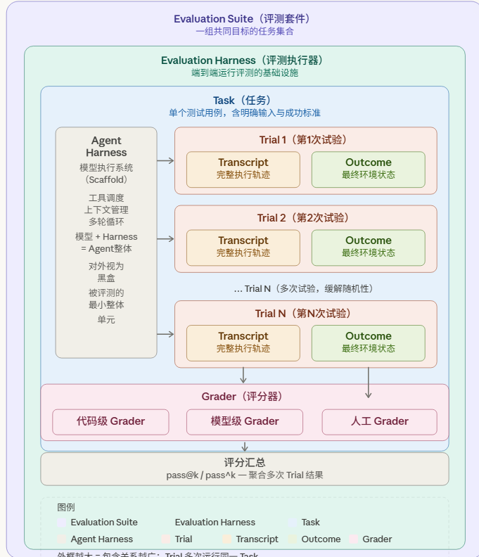
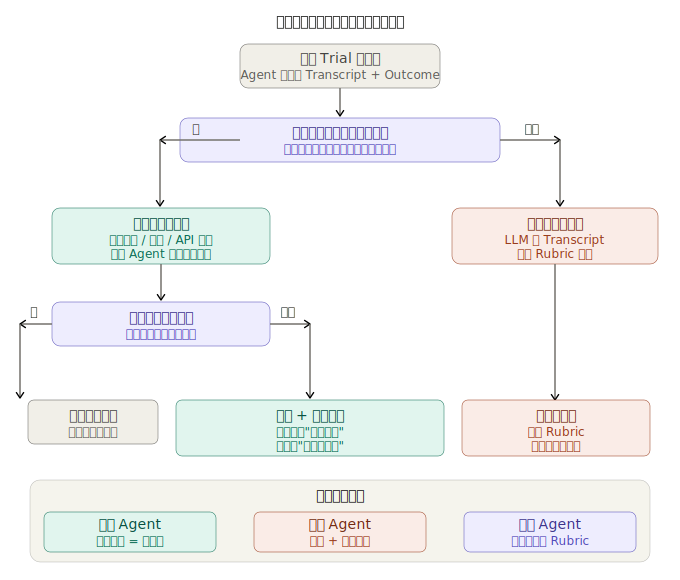

# Anthropic Agent 评测体系深度解析

## 零、 核心洞察与总览

过去我们在开发 AI 时，习惯于“摸黑飞行”——改了一版提示词，内部随便测几下觉得“变聪明了”就上线。但对于能够自主使用工具、改变环境状态的 AI Agent 来说，这种靠直觉的做法会导致灾难。

**Agent 评测的本质，是将“好不好用”这种主观感觉，转化为可量化、可追踪的自动化工程信号。** 我们评测的不再是“裸模型”，而是“模型 + 它的工具脚手架（Harness）”的综合表现。建立这套体系，能为团队带来巨大的**长期复利**：每一次代码变更，你都能在几分钟内明确知道准确率、耗时和成本是进步了还是退化了。

### 文章结构目录 (Table of Contents)

- **Anthropic Agent 评测体系**
  - [一、 是什么 (What)：Agent 评测的“自动化流水线”](#一-是什么-what-agent-评测的自动化流水线)
  - [二、 为什么 (Why)：核心动机与价值](#二-为什么-why-核心动机与价值)
  - [三、 怎么做 (How)：从零到一的八步路线图](#三-怎么做-how-从零到一的八步路线图)
  - [四、 核心理念：结果评测 (Outcome) vs 过程评测 (Transcript)](#四-核心理念结果评测-outcome-vs-过程评测-transcript)
  - [五、 评分机制 (Graders)：如何科学地打分？](#五-评分机制-graders-如何科学地打分)
  - [六、 落地场景 (Scenarios)：不同 Agent 的侧重点](#六-落地场景-scenarios-不同-agent-的侧重点)
  - [七、 核心指标 (Metrics)：应对非确定性](#七-核心指标-metrics-应对非确定性)
  - [八、 总结](#八-总结)

## 一、 是什么 (What)：Agent 评测的“自动化流水线”

评测 Agent 远比评测单纯的 LLM（大语言模型）难得多。单纯的模型评测就像是“闭卷考试”（一问一答），而 Agent 评测则是“开卷+实操考试”（模型需要自己使用工具、多轮反思、甚至纠正自己的错误）。

为了通俗易懂，我们引入一个**“考驾照”的通俗类比**来拆解核心概念：

这几个概念的关系就是一个完整的“评测流水线”——从最小单元到最大容器层层嵌套。下面结合“考驾照”的通俗类比，逐个解释每个概念的作用和存在的必要性：

1. **Evaluation Suite（评测套件）**：整个系统的最外层容器。它是一组有共同目标的 Task 的集合（比如驾考科目二的完整题库）。它的作用是让你能区分“能力评测”和“回归评测”（能力评测问的是"Agent 现在能做到什么？"——从低分开始往上爬坡。回归评测问的是"Agent 还能做到它以前会的事吗？"——从高分开始守住底线。），并决定哪些任务在什么时机运行。
2. **Evaluation Harness（评测执行器）**：驱动整个评测流程的基础设施。它负责给 Agent 下发任务、并发运行多个 Trial、记录所有步骤、调用 Grader 打分，最后汇总结果。你可以把它理解为“驾考中心的调度系统”，没有它，一切只是零散的脚本。
3. **Task（任务）**：最小的可测试单元（比如具体的科目“侧方位停车”）。它必须有明确的输入和成功标准。重点在“明确”——如果两个领域专家读同一个 Task 描述后对“通过”的定义不一致，这个 Task 产生的评分数据就是噪音而不是信号。
4. **Agent Harness / Scaffold（Agent 脚手架）**：让模型“变成 Agent”的执行系统——负责工具调度、上下文管理、多轮循环控制（相当于考生的驾驶习惯和手脚协调能力）。关键点：你评测的不是裸模型，而是“模型 + Harness”的整体，同一个模型配不同的 Harness，结果差异巨大。
5. **Trial（试验）**：对同一个 Task 的一次执行尝试。由于模型输出存在随机性，单次运行的结果不可信（就像不能仅凭一次停车就发驾照），你需要多次 Trial 才能知道真实能力。这也是衡量“偶尔成功”(pass@k)和“稳定成功”(pass^k)这两个指标存在的原因。
6. **Transcript（执行轨迹）**：一次 Trial 的完整记录（就像行车记录仪），包含所有工具调用、推理过程和中间结果。它是调试的核心工具——当评分低时，你必须读它才能判断是 Agent 真出错了，还是考官（Grader）判错了。
7. **Outcome（最终状态）**：Trial 结束后环境里实际发生的事。最经典的例子：Agent 说“航班已订好”（这是 Transcript 里的文字），但数据库里根本没记录——Outcome 才是 false（车到底停没停进车位）。这个区分防止了“光说不练”的假阳性。
8. **Grader（评分器）**：打分逻辑本体（副驾驶的考官）。它同时消费 Transcript 和 Outcome，分为代码级（快速/客观）、模型级（用 LLM 处理开放性问题）和人工级（校准前两者）。三者组合使用，而非单选。

> **一句话串联整个体系：** Evaluation Suite 划定范围 → Evaluation Harness 驱动运行 → Task 定义"考什么" → Agent Harness 驱动 Agent 执行 → Trial 多次运行消除随机性 → 每次 Trial 产生 Transcript（过程）和 Outcome（结果）→ Grader 同时评估两者 → 最终聚合为评测指标。

## 二、 为什么 (Why)：核心动机与价值

- **突破“摸黑飞行”的瓶颈**：当 Agent 进入生产并开始扩展，依靠手动测试和直觉就会崩溃。用户反映“感觉变差了”，团队却没有任何验证方式。
- **应对 Agent 独有的评测难题**：Agent 在多个回合中使用工具、修改环境状态，这意味着**错误可以级联传播**。同时，前沿模型还能找到超出静态评测限制的创造性解法（比如发现了测试环境的漏洞并利用它完成任务）。
- **享受评测的长期复利**：一旦有了评测，你就可以免费获得基线和回归测试：延迟、Token 用量、每任务成本和错误率都可以在静态任务库上追踪，成为产品团队与研究团队之间带宽最高的沟通渠道。

## 三、 怎么做 (How)：从零到一的八步路线图

不要被庞大的工程吓倒，Anthropic 给出了循序渐进的三个阶段：

### 阶段一：搞定考题（构建初始数据集）
* **Step 0 — 尽早开始**：别等系统庞大了再做，从日常真实遇到的 20-50 个简单失败案例开始即可。早期每次变更影响都很大，小样本就足够了。
* **Step 1 — 从手动检查转化**：将每次发布前验证的行为、Bug 追踪器和用户反馈转化为测试用例。
* **Step 2 — 编写无歧义任务**：考题和标准答案必须清晰。如果两个人类专家对“怎么算及格”都有分歧，这个任务就是废的，只会产生噪音。
* **Step 3 — 构建均衡问题集**：不仅要考“它该做什么”，还要考“它不该做什么”（比如：别过度搜索）。单方向的评测会导致单方向的优化。

### 阶段二：搞定考场与阅卷（设计运行与评分）
* **Step 4 — 稳定的评测环境**：每次测试前必须清理缓存和残留，保证环境干净。避免基础设施不稳定导致任务失败。
* **Step 5 — 精心设计 Grader（评结果不评路径）**：不要死板地规定它必须按特定顺序调用工具，别扼杀 AI 的创造力。评估 Agent 生成了什么，而不是它采取了什么路径。

### 阶段三：长期维护与使用（日常运营）
* **Step 6 — 读 Transcript**：当 AI 失败时，开发者必须亲自阅读轨迹，判断到底是 AI 蠢，还是评分器判错了。失败应该显得公平。
* **Step 7 — 监控评测饱和**：当模型越来越强，全拿 100 分时，这套题就该“退居二线”作为回归测试题，你需要去寻找更难的新题。
* **Step 8 — 开放贡献机制**：建立专门的评测团队负责基础设施，领域专家和产品团队贡献大多数任务并自己运行，像维护单元测试一样常规。

## 四、 核心理念：结果评测 (Outcome) vs 过程评测 (Transcript)

在设计评测时，首先要把两个核心概念对齐：
* **结果评测 (Outcome)**：看的是试验结束后环境里**真实发生了什么**（例如数据库状态、文件系统的物理改变）。
* **过程评测 (Transcript)**：看的是 Agent **走了哪条路、调了哪些工具、推理了什么**。

两者绝对不是非此即彼的关系，Anthropic 的核心主张是**分层叠加**——**先用结果评测锁定“做到没有”，再用过程评测追问“做得好不好”。**

### 1. 判断逻辑与叠加结构

以下两张图分别展示了何时该用哪种评测的**决策树**，以及两者的**分层叠加结构**：

### 2. 三类 Agent 中的具体叠加方式

在明确了决策树和叠加结构后，我们来看看不同类型的 Agent 是如何具体结合这两种评测的：

| Agent 类型 | 结果评测 (Outcome) - 第一层：做到没有？ | 过程评测 (Transcript) - 第二层：做得好不好？ |
| :--- | :--- | :--- |
| **编程 Agent** | 代码是否编译通过？单元测试是否跑通？ | 代码逻辑是否极度冗余？是否调用了危险/未授权的权限？ |
| **对话 Agent** | 用户的工单状态是否成功流转为“已解决”？ | 语气是否有同理心？解决问题的回合效率高不高？ |
| **研究 Agent** | 是否成功生成了最终的 Markdown 报告文件？ | 报告信息的综合是否全面？（无客观绝对答案，需依赖 Rubric） |

### 3. 关键逻辑补充说明

**① 结果评测是地基，不可绕过**
核心理由是：**Agent 的自我报告绝对不可信**。Agent 说“完成了”只是 Transcript 里的文字，这极可能是大模型的幻觉。Anthropic 明确用航班预订举例：Agent 回复“您的航班已为您订好”是 Transcript，而数据库里是否真的存在这笔预订记录才是 Outcome。只要任务在环境里留有可检查的痕迹，结果评测就必须先做。

**② 何时必须加过程评测？（三个明确信号）**
* **信号一：任务没有客观终态。** 比如让研究 Agent 写一份市场分析报告，“综合得是否全面”并没有非黑即白的二元答案，此时只能靠 LLM 裁判基于 Rubric 去评 Transcript。
* **信号二：结果评测通过但行为存疑。** 比如单元测试全过了（Outcome 过关），但 Agent 写的代码极度冗余，或者在过程中调用了危险权限。这些“暗病”只在 Transcript 里可见。
* **信号三：交互过程本身就是评测内容。** 比如对话 Agent，它的语气、同理心表达、回合效率，这些根本就不体现在最终的环境状态里，过程本身即产品。

### 4. Transcript 与 Rubric：过程评测的核心工具

在进行过程评测前，必须先对齐两个核心概念：

- **Transcript（执行轨迹）**：它是“案发现场的监控录像”。不仅是用户和 Agent 的来回对话，而是完整记录了一次 Trial 中按时序展开的全部细节——包括用户输入、模型内部推理、每次工具调用的入参、工具返回的原始数据，甚至中间尝试过但被放弃的路径。
- **Rubric（评分维度清单）**：它是“评委的打分表”。将“好不好”这种主观且模糊的问题，拆解成一系列带有明确标准的具体问题，让 LLM 裁判逐一回答 Yes/No 或进行 1–5 分的打分。

这两者的关系是：**Rubric 是问题，Transcript 是答案的来源，而 LLM-as-judge 是阅卷人。**

在落地时，有几个极易被忽略的工程细节：

- **Transcript 的价值在于“内幕”**：很多时候最终答案（Outcome）是对的，但只有通过 Transcript 才能发现 Agent 内部推理是否荒谬、工具是否被滥用或过度调用。
- **Rubric 的粒度决定评测可信度**：切忌使用“回答质量好吗？”这种模糊指标。应当拆解为具体行为，例如：“回复中是否包含对客户情绪的显式确认（如'抱歉给您带来不便'）？”标准越具体，LLM 打分越稳定。
- **推荐“每维独立调用 LLM”打分**：Anthropic 明确建议，不要把所有 Rubric 塞给一个 LLM 一次性评完。分开调用能避免“晕轮效应”（一个维度的强表现拉高其他维度），且调试更方便——当某个维度分数异常时，可以直接定位该维度的 Prompt 进行排查。
- **LLM 裁判必须与人工定期校准**：哪怕 Rubric 再精细，LLM 和领域专家的判断也会发生漂移。正确的做法是：周期性抽样一批 Transcript，让人工与 LLM 分别打分并比对分歧，借此修订 Rubric 的措辞。校准通过后，日常评测再交由 LLM 自动化完成。

### 5. ⚠️ 过程评测最容易踩的坑：检查路径而非行为

Anthropic 明确警告：**千万不要去验证 Agent 是否按照精确的顺序调用工具**（例如写死必须按照 `read_file → edit_file → run_tests` 的顺序）。

Agent 具有创造力，它完全可能先 `run_tests` 去探查失败的报错原因，然后再去 `read_file` 找代码，最终照样完美解决了问题。如果你把执行顺序写死在评分器里，就是在**惩罚 AI 的创造力**。

**正确做法**：检查“关键工具有没有被调用过”，以及“最终输出符不符合 Rubric”。要评测的是**行为的存在性和质量，而不是去评测路径的形状。**

## 五、 评分机制 (Graders)：如何科学地打分？

给 Agent 打分不能只靠一种手段，通常需要“三管齐下”：

| 类型 | 方法 | 优势 | 局限 |
|------|------|------|------|
| **代码级 Grader** | 字符串匹配、二元测试、静态分析、工具调用验证 | 快速、廉价、客观、可复现、易调试 | 对未预期的有效变体脆弱，缺乏细腻度 |
| **模型级 Grader** | Rubric 评分、自然语言断言、两两比较、多 Judge 共识 | 灵活、可扩展、捕捉细微差别、处理开放性任务 | 不确定性高、成本更高、需与人工校准 |
| **人工 Grader** | 专家审查、众包判断、抽样检查、A/B 测试 | 黄金标准、匹配专家用户判断、用于校准模型 Grader | 昂贵、缓慢、难以大规模获取专家 |

> **实战建议**：对每个任务，评分可以是加权的（多个 Grader 分数合并须超过阈值）、二元的（所有 Grader 必须通过）或混合的。

## 六、 落地场景 (Scenarios)：不同 Agent 的侧重点

不同的 Agent，考核重点完全不同：
* **编程 Agent**：看重代码是否能编译、单元测试能否跑通（如 SWE-bench）。天然适合确定性 Grader。
* **对话 Agent**：面临独特挑战，交互质量本身就是评测内容。不仅看问题是否解决（状态检查），还要看是否啰嗦（Transcript 约束），语气是否合适（LLM Rubric）。
* **研究 Agent**：重信息核查。研究质量只能相对于任务来判断，面临事实基准漂移、专家分歧等挑战。
* **计算机操作 Agent**：通过截图、鼠标点击与软件交互。看重在真实或沙盒环境中运行，并检查底层系统状态是否达到预期结果。

## 七、 核心指标 (Metrics)：应对非确定性

由于大模型的输出具有非确定性，业界用两个核心指标来衡量 Agent 的真正实力：

* **`pass@k`（潜力指标 / 容错率高的场景）**：给你 $k$ 次机会，只要有 1 次成功就算过。这就像“摸高测试”，测的是 Agent 的**能力上限**。随着 $k$ 增大，`pass@k` 上升——更多"射门机会"意味着至少成功 1 次的概率更高。
* **`pass^k`（稳定性指标 / 产品级场景）**：连续测试 $k$ 次，**必须每次都成功**才算过。这测的是 Agent 的**工程可靠性**。随着 $k$ 增大，`pass^k` 下降。如果一个 Agent 单次成功率是 75%，连续执行 3 次的全部通过概率只有 $(0.75)^3 \approx 42\%$。这解释了为什么很多 Demo 看起来很酷，但一上线就频频翻车——因为商业产品（如智能订票）要求极高的 `pass^k`。

## 八、 总结

Anthropic 的这套评测体系，本质上是一次 **AI 开发范式的转移**：将玄学般的“Prompt 调优”，变成了严谨的“软件工程”。

它最大的价值在于：将"AI Agent 好不好用"这种主观判断，转化为可量化、可追踪、可自动化的工程信号。只有建立了这套体系，AI 团队才能在每次模型升级或代码变更时，拥有真正的底气去迭代模型、重构代码，在数天内（而非数周）做出有依据的决策，并最终交付让用户信任的 Agent 产品。
